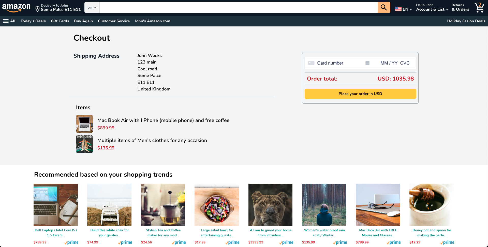
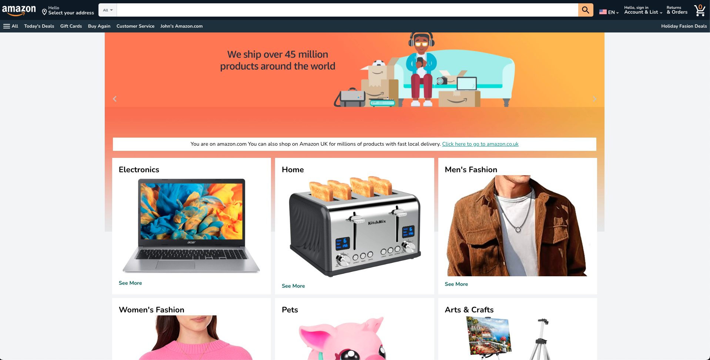

# Amazon Clone

Welcome to the Amazon Clone project! This repository contains the source code for a fully-functional e-commerce application inspired by Amazon. Built with Laravel, PHP, and Vue.js, this project demonstrates the capabilities of modern web development frameworks and practices.




## Features

- User authentication and authorization
- Product browsing and searching
- Shopping cart and checkout
- Order management
- Payment integration with Stripe
- Responsive design with Vue.js and Inertia.js

## Getting Started

Follow these steps to get the project up and running on your local machine.

### Prerequisites

Ensure you have the following installed:

- PHP 7.4 or higher
- Composer
- Node.js and npm
- MySQL or SQLite

### Installation

1. Clone the repository:

    ```bash
    git clone https://github.com/Ayanda247/Full-stack-Amazon-Clone.git
    cd amazon-clone
    ```

2. Install the dependencies:

    ```bash
    composer install
    ```

3. Copy the example environment file and modify the necessary settings:

    ```bash
    cp .env.example .env
    php artisan cache:clear
    composer dump-autoload
    php artisan key:generate
    ```

4. Install Laravel Breeze with Vue and Inertia:

    ```bash
    composer require laravel/breeze --dev
    php artisan breeze:install vue --inertia
    ```

5. Serve the application:

    ```bash
    php artisan serve
    ```

### Database Setup

1. Create your database configuration in the `.env` file:

    ```env
    DB_CONNECTION=sqlite
    DB_HOST=127.0.0.1
    DB_PORT=3306
    DB_DATABASE=amazon_clone
    DB_USERNAME=root
    DB_PASSWORD=
    ```

2. Migrate your database:

    ```bash
    php artisan migrate
    php artisan db:seed
    ```

### Payment Integration

1. Create your Stripe account and generate public and private keys [here](https://stripe.com/en-gb-us).

2. Add your new private API key to `CheckoutController.php` and the `.env` file:

    ```env
    STRIPE_KEY=your_private_key
    ```

### Mailtrap Integration

1. Connect to Mailtrap and add the details to your `.env` file:

    ```env
    MAIL_MAILER=smtp
    MAIL_HOST=smtp.mailtrap.io
    MAIL_PORT=2525
    MAIL_USERNAME=your_username
    MAIL_PASSWORD=your_password
    MAIL_ENCRYPTION=null
    MAIL_FROM_ADDRESS="example@mail.com"
    MAIL_FROM_NAME="${APP_NAME}"
    ```

### Running the Project

1. Install the npm dependencies:

    ```bash
    npm install
    ```

2. Compile the assets:

    ```bash
    npm run dev
    ```

3. Access the application at `http://localhost:8000`.


